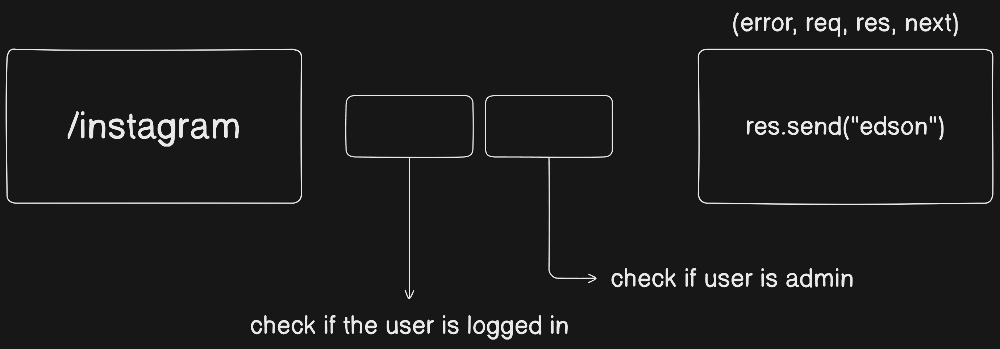
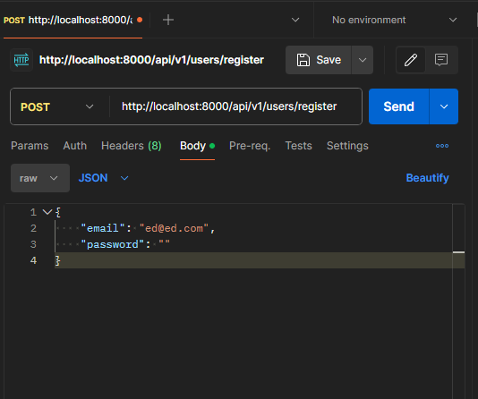
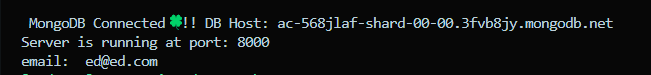

# Data Modelling
[Model link](https://app.eraser.io/workspace/5G0yWYx8zbjcswgnTjwY)

# DB Connection

- To connect to the database IP Address, Username-Password and a String is required.

> [!TIP]
>
> - Whenever trying to communicate with the database, problem will arise. Wrap DB Connection code inside _try-catch_.
> - DB is always in other Continent. Meaning it will take time, use _async-await_.

# DB connection inside index.js file

Not good approach, pollutes index file.

```javascript
// index.js
import express from "express";
const app = express();

(async () => {
  try {
    await mongoose.connect(`${process.env.MONGODB_URI}/${DB_NAME}`);
    // listeners
    app.on("error", (error) => {
      console.log("ERROR: ", error);
      throw error;
    });
    // if no error
    app.listen(process.env.PORT, () => {
      console.log(`App is listening on port: ${process.env.PORT}`);
    });
  } catch (error) {
    console.error("ERROR: ", error);
    throw error;
  }
})();
```

# process.exit

Read the [Documentation](https://nodejs.org/api/process.html#event-exit)

# Return Object from Mongoose

Mongoose always gives you a return object when connecting to the database. This is handled by mongoose. In the below code variable _connectionInstance_ is the return object.

```javascript
const connectDB = async () => {
  try {
    const connectionInstance = await mongoose.connect(
      `${process.env.MONGODB_URI}/${DB_NAME}`
    );
  } catch (error) {
    console.log("MONGODB Connection error ", error);
    process.exit(1);
  }
};
```

# dotenv Configutation

The below code will work successfully. But do not use this if type _module_ is followed in the project. This will ruin the consistency

```javascript
require("dotenv").config({ path: "./env" });
```

If using the import statement, use dotenv as experimental feature 👇

```javascript
import dotenv from "dotenv";

dotenv.config({
  path: "./env",
});
```

```bash
// package.json
"scripts": {
    "dev": "nodemon -r dotenv/config --experimental-json-modules src/index.js"
}
```

# Express

When an async code gets executed (here DB connection), it will return a promise.

```javascript
connectDB().then().catch();
```

# App listen

So far only the DB is connected. Using DB, the app did not start to listen. Therefore,

```javascript
connectDB()
  .then(() => {
    app.listen(process.env.PORT || 8000, () => {
      console.log(`Server is running at port: ${process.env.PORT}`);
    });
  })
  .catch((err) => {
    console.log("MongoDB connection failed!!", err);
  });
```

# Throwing error

In JavaScript, the "throw" statement is used to manually throw an exception. When an exception is thrown, it interrupts the normal flow of the program and transfers control to the nearest exception handler. In the given code snippet, the "throw error" statement is used to throw the error that occurred while running the server. By throwing the error, the code ensures that the error is not ignored and is propagated to the nearest exception handler. This allows for proper error handling and debugging of the server application.

```javascript
app.on("error", (error) => {
  console.log("ERROR: Failed to run the server: ", error);
  throw error;
});
```

### Exception Handler 👇

```javascript
.catch((err) => {
    console.log("MongoDB connection failed!!", err);
  });
```

# app.use()

Whenever there is a requirement to setup a middleware or any configuration, **_app.use()_** is used.

# Cookie Parser

Cookie parser is a middleware that is used to parse cookies that are sent by the client to the server. It is used to extract the cookie data from the HTTP request and convert it into a usable format that can be accessed by the server-side code. It also parses the cookie data to extract individual values such as the cookie name, value, and expiration date.

Cookies are small pieces of data that are stored on the user's computer by the web browser. They are used to track user preferences, maintain user sessions, and personalize the user experience.

Cookie parser is used in ExpressJS applications to simplify the process of parsing and managing cookies. It provides developers with convenient access to client-side cookies for various purposes, including session management and security.

Cookie parser is a valuable tool for developers who are building ExpressJS applications. It can help to simplify the process of parsing and managing cookies, and it can provide developers with convenient access to client-side cookies for various purposes.

# Middlewares

When using middleware we use _next_ as the parameter along with _(req, res)_.

# Async Operation Wrapper
```javascript
// asyncHandler.js
const asyncHandler = (requestHandler) => {
  (req, res, next) => {
    Promise.resolve(requestHandler(req, res, next)).catch((err) => next(err));
  };
};

export { asyncHandler };
```

# Nodejs API Error
[documentation](https://nodejs.org/api/errors.html)

Read from the nodejs documentation about the concept of _this.data_

# Error Format
```javascript
// apiError.js
class apiError extends Error {
  constructor(
    statusCode,
    message = "Something went wrong",
    errors = [],
    stack = ""
  ) {
    super(message);
    this.statusCode = statusCode;
    this.data = null;
    this.message = message;
    this.success = false;
    this.errors = errors;

    if (stack) {
      this.stack = stack;
    } else {
      Error.captureStackTrace(this, this.constructor);
    }
  }
}

export { apiError };
```

# Success Format
```javascript
// apiResponse.js
class apiResponse {
  constructor(statusCode, data, message = "Success") {
    this.statusCode = statusCode;
    this.data = data;
    this.message = message;
    this.success = statusCode < 400;
  }
}

export { apiResponse };
```

# Does MongoDB use BSON or JSON?
MongoDB stores data in BSON format both internally, and over the network, but that doesn’t mean you can’t think of MongoDB as a JSON database. Anything you can represent in JSON can be natively stored in MongoDB, and retrieved just as easily in JSON.

When using the MongoDB driver for your favorite programming language, you work with the native data structures for that language. The driver will take care of converting the data to BSON and back when querying the database.

Unlike systems that store JSON as string-encoded values, or binary-encoded blobs, MongoDB uses BSON to offer powerful indexing and querying features on top of the web’s most popular data format.

[More information](https://www.mongodb.com/json-and-bson)

# Making fiels searchable
If any fields are made to be searchable, make it's index _true_.
```javascript
username: {
      type: String,
      required: true,
      unique: true,
      lowercase: true,
      trim: true,
      index: true, // here
    },
```

> [!Note]
> Making _index: true_ can make the website slow or can be end up in the expensive side. So be careful before making any fields searchable.

# MongoDB Aggregation Pipeline
- [npm package](https://www.npmjs.com/package/mongoose-aggregate-paginate-v2)
- [Documentation](https://www.mongodb.com/docs/manual/core/aggregation-pipeline/)

# bcrypt (or bcryptjs) and JSON Web Token(jwt)
- Bcrypt which is similar to BcryptJS is a npm package to hash passwords. 

  [bcrypt npm package](https://www.npmjs.com/package/bcrypt)

  [bcryptjs npm package](https://www.npmjs.com/package/bcryptjs)

- JWT is a npm package for getting npm tokens
  [npm package](https://www.npmjs.com/package/jsonwebtoken)

# Mongoose Pre Hook
Just because bcrypt package is installed, doesn't mean it encrypts the sensitive datas automatically. We need to use a Mongoose Middleware Hook called _[Pre](https://mongoosejs.com/docs/middleware.html#pre)_

When the user wants to store any data in the MongoDB, just before the data gets saved, we can run the Pre Hook to encryt the data.

# Encrypting password (aka middleware)
Two scenarios:
- If the user is creating a new account, he/she will write the password and submit the profile . When clicked on the save button; the password needs be saved in an encrypted format.
  ```javascript
  userSchema.pre("save", async function (next) {
  this.password = bcrypt.hash(this.password, 10); // 10 rounds
  next();
  });
  ```
- The above code is written in such a way that if the user has already created an account but wants to change/update the avatar, when clicked on the save button, the password will get saved again. This is a major issue. Therefore a condition should be written in such a way that the password needs to be saved in the database only if the password field is modified.
  ```javascript
  userSchema.pre("save", async function (next) {
  if(!this.isModified("password")) return next();
  this.password = bcrypt.hash(this.password, 10);
  next();
  });
  ```

> [!Note]
> If _next_ is used in the callback function as a parameter, then it is a middleware

# JWT
JWT is a bearer token. In Layman words, who ever has this JWT Bearer Token, the corresponding data will be sent to them.

# HTTP (Hyper Text Transfer Protocol) | HTTP Methods | HTTP Headers

[Notes](https://www.linkedin.com/posts/hiteshchoudhary_http-crash-course-notes-activity-7130464152002658304-52df/)

## What are HTTP Headers?
Metadata ==> Key-Value sent along with request and response.

### Where HTTP Headers are used?
- Caching, authentication, manage state
- X-prefix ==> 2012(X-deprecated)

### Types of Headers
- Request Headers ==> from Client
- Response Headers ==> from Server
- Representation Headers ==> encoding/compression
- Payload Headers ==> data

### Most common Headers
- Accept: application/json
- User-Agent
- Authorization
- Content-Type
- Cookie
- Cache-Control

### CORS
- Access-Control-Allow-Origin
- Access-Control-Allow-Credentials
- Access-Control-Allow-Method

### Security
- Cross-Origin-Embedders-Policy
- Cross-Origin-Opener-Policy
- Content-Security-Policy
- X-XSS-Protection

## What are HTTP Methods?
Basic set of operations that can be used to interact with server.

- GET => Retrive a resource
- HEAD => No message body (response headers only)
- OPTIONS => What operations are available
- TRACE => Loopback test (get same data)
- DELETE => Remove a resource
- PUT => Replace a resource
- POST => Interact with resource (mostly add)
- PATCH => Change part of a resource

## HTTP Status Code
- 1xx => Informational
- 2xx => Success
- 3xx => Redirection
- 4xx => Client Error
- 5xx => Server Error
---
- 100 => Continue
- 102 => Processing
- 200 => OK
- 201 => Created
- 202 => Accepted
- 307 => Temporary Redirect
- 308 => Permanent Redirect
- 400 => Bad Request
- 401 => Unauthorized
- 402 => Payment Required
- 404 => Not Found
- 500 => Internal Server Error
- 504 => Gateway Timeout

# Logic Building 
The more controllers one writes, the better they become in logic building.

## Steps to improve logic building.
Take a bigger problem and split it into multiple smaller problems. Solve these smaller problems one by one.

# Router and Controller

# Exporting issues
There are two main ways in which a file can be imported and exported.

1) A file can be imported like `import userRouter from "./routes/user.routes.js";` only when the file is **exported default**. Like this `export default router;`

2) A file can be imported like `import { registerUser } from "../controllers/user.controller.js";` only when the file is **not exported default**. Like this `export { registerUser };`

# Steps for user registration
1) Get user details from frontend (depends on how data modelling is designed)

2) Validation - not empty

3) Chech if user already exits: username, email

4) Check for images, check for avatar

5) upload them to cloudinary, avatar

6) Create user object - create entry in DB

7) Remove password and refresh token field from response

8) Check for user creation

9) Return response

# Check if the response is received from postman
Code
```javascript
const { fullname, email, username, password } = req.body;
console.log("email: ", email);
```
Postman



Output will be displayed in terminal/console
